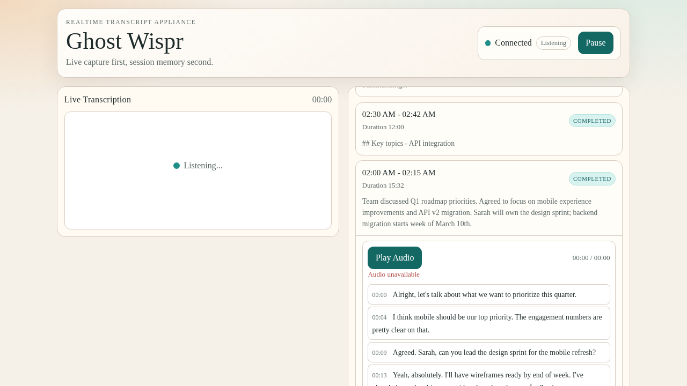
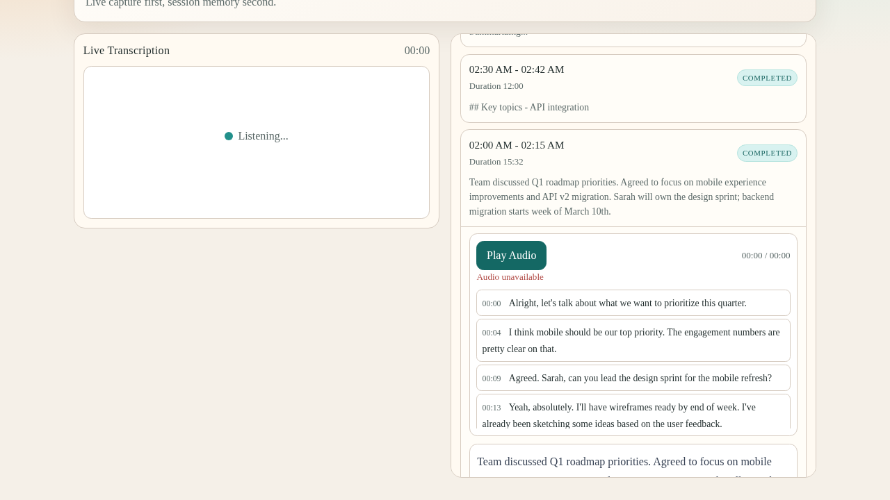

# Ghost Wispr

Always-on transcription appliance. Listens to your microphone, detects speech, and produces timestamped transcripts with session history, audio playback, and AI-generated summaries.



## What it does

Ghost Wispr runs as a background service on a machine with a microphone (e.g. a Raspberry Pi in a meeting room). It captures audio continuously, detects silence gaps to split recordings into sessions, sends audio to Deepgram for real-time transcription, and stores everything locally in SQLite.

When a session ends, it optionally generates a summary via OpenAI and can sync audio files to Google Drive.

The web UI shows live transcription on the left and session history on the right. Click any past session to expand its full transcript and play back audio.



## Architecture

```
Microphone → Deepgram WebSocket → Session Manager → SQLite
                                       ↓
                                  Audio Recorder (MP3)
                                       ↓
                                  WebSocket Hub → Browser
```

**Backend** (Go):
- `cmd/ghost-wispr/main.go` — entry point, microphone/Deepgram orchestration
- `internal/session/` — silence-based session detection and lifecycle management
- `internal/audio/` — PCM recording with MP3 encoding
- `internal/storage/` — SQLite persistence (WAL mode)
- `internal/server/` — HTTP API, WebSocket event hub, SPA serving
- `internal/summary/` — OpenAI summarization
- `internal/gdrive/` — Google Drive sync (optional)

**Frontend** (Svelte 5):
- PWA with offline support
- Real-time transcript updates via WebSocket
- Session history grouped by date
- Audio playback with seek-to-segment

## Requirements

- Go 1.25+
- Node.js 22+
- A USB or built-in microphone (PortAudio)
- Deepgram API key (required for transcription)
- OpenAI API key (optional, for summaries)

### System dependencies

PortAudio is required for microphone access:

```bash
# Debian/Ubuntu/Raspberry Pi
sudo apt-get install portaudio19-dev

# macOS
brew install portaudio
```

## Setup

```bash
# Clone
git clone https://github.com/sjawhar/ghost-wispr.git
cd ghost-wispr

# Configure
cp .env.example .env
# Edit .env with your API keys

# Build
make build

# Run
source .env && ./ghost-wispr
```

The web UI is available at `http://localhost:8080`.

## Configuration

All configuration is via environment variables. See `.env.example` for the full list.

| Variable | Required | Default | Description |
|----------|----------|---------|-------------|
| `DEEPGRAM_API_KEY` | Yes | — | Deepgram API key for transcription |
| `OPENAI_API_KEY` | No | — | OpenAI key for session summaries |
| `OPENAI_MODEL` | No | `gpt-4o-mini` | Model to use for summaries |
| `DB_PATH` | No | `data/ghost-wispr.db` | SQLite database path |
| `AUDIO_DIR` | No | `data/audio` | Directory for audio files |
| `SILENCE_TIMEOUT` | No | `30s` | Silence duration to end a session |
| `MIC_SAMPLE_RATE` | No | `16000` | Preferred microphone sample rate |
| `MIC_SAMPLE_RATES` | No | `48000,44100,32000,24000` | Fallback sample rates to try |
| `GDRIVE_FOLDER_ID` | No | — | Google Drive folder for audio sync |
| `GOOGLE_APPLICATION_CREDENTIALS` | No | — | Path to service account JSON |

## Deployment

A systemd service file is included for running on a headless device:

```bash
# Edit ghost-wispr.service with your paths and user
sudo cp ghost-wispr.service /etc/systemd/system/
sudo systemctl enable --now ghost-wispr
```

A `deploy.sh` script handles cross-compilation and deployment to a Raspberry Pi:

```bash
PI_HOST=pi@raspberrypi ./deploy.sh
```

## API

| Method | Path | Description |
|--------|------|-------------|
| `GET` | `/api/sessions?date=YYYY-MM-DD` | List sessions for a date (defaults to today) |
| `GET` | `/api/sessions/{id}` | Get session details with transcript segments |
| `GET` | `/api/sessions/{id}/audio` | Stream session audio (supports range requests) |
| `POST` | `/api/pause` | Pause transcription |
| `POST` | `/api/resume` | Resume transcription |
| `WS` | `/ws` | Real-time events (transcripts, session state) |

## Development

```bash
# Run backend tests
go test ./...

# Run frontend tests
cd web && npm test

# Frontend dev server (with hot reload, proxies API to :8080)
cd web && npm run dev
```

## License

MIT
